# 1. 介绍

2023-11-25 我在 GitHub 上提交了 [EfficientTransformer](https://github.com/Illusionna/ComputerVision/tree/main/EfficientTransformer) 的比赛代码，近一年后的今天，我在删除电脑磁盘上吃灰的文件时，再次发现到它。由于去年写的函数接口很简约，所以这次重写 ViT 代码，修改了很多冗余的语句，并在其他图片集上进行测试，没想到这个神经网络模型效果依然这么好。

该项目代码是用于图片集训练、测试、预测的 Vision Transformer 神经网络架构。你可以下载已提供的数据集，当然，你也可以将代码运行在自己的图片集上。然而，需要注意的是，该项目仅是 demo 演示，不建议你将代码部署工业生产。

# 2. 数据集

已提供的图片集有三种：动物、水果、血细胞。你可以自定义新的图片集，不过需要满足一定的规则，否则代码可能无法运行。参考已提供的三种图片集文件夹或文件放置结构即可，发现其中的规律对你来说轻而易举？

三种图片集共约 1 GB 磁盘占用，所以 git 仓库里只放置了“水果”的图片集压缩包，另外两种数据集推荐使用百度网盘下载。在你运行代码前记得解压缩哦。

- 血细胞（[下载链接 1 路由 BaiduNetdisk 提取码 nl86](https://pan.baidu.com/s/1efoe_ptRAQ6Nv6RwCzmETQ?pwd=nl86)、[下载链接 2 路由 Amazon](https://prod-dcd-datasets-cache-zipfiles.s3.eu-west-1.amazonaws.com/snkd93bnjr-1.zip)）：包含 neutrophils、eosinophils、basophils、lymphocytes、monocytes、immature granulocytes、erythroblasts、platelets 八类。
- 动物（[下载链接 BaiduNetdisk 提取码 nl86](https://pan.baidu.com/s/1efoe_ptRAQ6Nv6RwCzmETQ?pwd=nl86)）：包括猫、狗两类。
- 水果（[下载链接 BaiduNetdisk 提取码 nl86](https://pan.baidu.com/s/1efoe_ptRAQ6Nv6RwCzmETQ?pwd=nl86)）：包括 Apple、Carambola、Pear、Plum、Tomatoes 五类。

说句题外话，你可以把这三类图片集整合到一块，形成一个共计 15 类的更大数据集，再尝试训练测试 ViT 模型。项目工作区结构如下：

<p style="text-align: center;">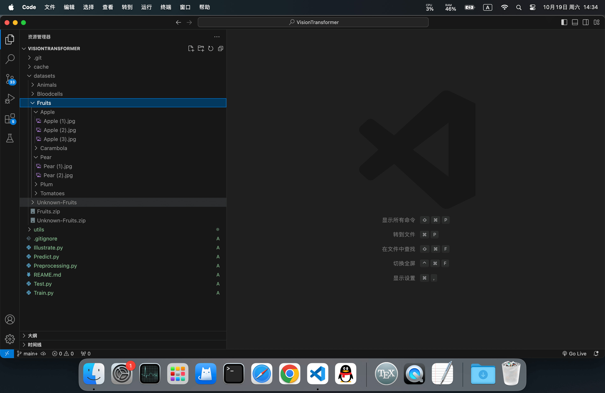</p>

项目结构文件的描述如下：

```
.
├── cache
│   ├── log
│   │   ├── Animals-train_loss(0.48440)valid_loss(0.40608).pt (动物图片训练 200 次后的权重)
│   │   └── Fruits-train_loss(0.12103)valid_loss(0.04023).pt (该权重可以直接用于测试、预测)
│   ├── Animals-info.json (动物数据集详情)
│   ├── Animals-map.json (动物数据集划分映射)
│   ├── Animals-net.txt (动物图片集对应的神经网络结构)
│   ├── Animals-test.json
│   ├── Animals-train.json
│   ├── Fruits-info.json
│   ├── Fruits-map.json
│   ├── Fruits-net.txt
│   ├── Fruits-test.json (水果测试集正确率)
│   └── Fruits-train.json (水果训练集训练过程)
├── datasets
│   ├── Animals (动物数据集)
│   │   ├── cat (猫类)
│   │   └── dog (狗类)
│   ├── Bloodcells
│   │   ├── basophil
│   │   ├── eosinophil
│   │   ├── erythroblast
│   │   ├── ig
│   │   ├── lymphocyte
│   │   ├── monocyte
│   │   ├── neutrophil
│   │   ├── platelet
│   │   └── README.md (血细胞数据集介绍, 不必管它)
│   ├── Fruits (水果数据集)
│   │   ├── Apple (苹果类)
│   │   │   ├── Apple (1).jpg (苹果类的某张图片)
│   │   │   ├── Apple (2).jpg
│   │   │   └── Apple (3).jpg
│   │   ├── Carambola
│   │   ├── Pear (梨子类)
│   │   │   ├── Pear (1).jpg
│   │   │   └── Pear (2).jpg (梨子类的某张照片)
│   │   ├── Plum
│   │   └── Tomatoes
│   ├── Unknown-Fruits (未知水果, 被用于预测)
│   │   ├── Fruit (a).jpg
│   │   ├── Fruit (b).jpg
│   │   ├── Fruit (c).jpg
│   │   ├── Fruit (d).jpg (某个未知的水果, 使用 Predict.py 代码进行预测)
│   │   └── Fruit (e).jpg
│   ├── Fruits.zip (水果数据集压缩包, 解压后, 顶替 Fruits 文件夹所有示例文件)
│   └── Unknown-Fruits.zip (未知水果的压缩包, 解压缩后, 顶替 Unknown-Fruits 文件夹)
├── utils
│   ├── einops (一个面向眼睛编程的张量库, 巨牛)
│   │   ├── experimental
│   │   │   ├── __init__.py
│   │   │   └── indexing.py
│   │   ├── layers
│   │   │   ├── __init__.py
│   │   │   ├── _einmix.py
│   │   │   ├── chainer.py
│   │   │   ├── flax.py
│   │   │   ├── keras.py
│   │   │   ├── oneflow.py
│   │   │   ├── paddle.py
│   │   │   ├── tensorflow.py
│   │   │   └── torch.py
│   │   ├── __init__.py
│   │   ├── _backends.py
│   │   ├── _torch_specific.py
│   │   ├── array_api.py
│   │   ├── einops.py
│   │   ├── packing.py
│   │   ├── parsing.py
│   │   └── py.typed
│   ├── linformer (一个把 Transformer 降低成线性复杂度的库)
│   │   ├── __init__.py
│   │   ├── linformer.py
│   │   └── reversible.py
│   ├── efficient.py (ViT 架构模型类)
│   ├── interface.py (自定义的接口文件)
│   ├── net.py (自定义的神经网络结构文件)
│   └── tool.py (自定义的工具文件)
├── Illustrate.py (插图函数, 需要单独安装库 >>> pip install matplotlib)
├── Predict.py (预测函数, 如果测试效果很好, 可将权重用于预测未知图片集)
├── Preprocessing.py (预处理函数, 对数据集进行处理, 之后可进行训练、测试、预测)
├── REAME.md (你正在阅读的文件)
├── Test.py (测试函数, 用于检测训练好的结果在测试集上的正确率)
└── Train.py (预处理完成后, 即可进行训练)
```

# 3. 依赖

该项目既支持 CPU 计算也支持 GPU 计算，如果你的电脑有图形处理器，可在终端使用 `nvidia-smi` 指令查看显卡型号，我的 GPU 显存是 4 GB 大小，且指令返回 CUDA 版本是 12.5 的型号。

```
NVIDIA-SMI 556.12   Driver Version: 556.12  CUDA Version: 12.5
```

你可在 [PyTorch](https://pytorch.org) 官网找到适合自己电脑的 Python 库，所以我在 Windows 11 上安装 torch-cu121 库。

<p style="text-align: center;">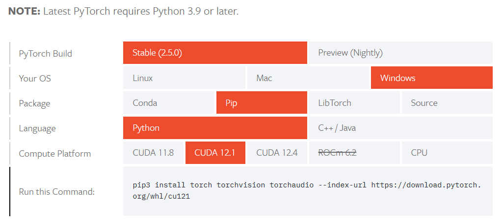</p>

推荐使用 Anaconda、Miniconda 或者 venv 虚拟环境下载 `Python 3.10+` 的依赖库。

> Conda
> - ```
>   conda create -n GPU python==3.10.0
>   ```
> - ```
>   conda activate GPU
>   ```
> - ```
>   pip install matplotlib
>   ```
> - ```
>   python Preprocessing.py 
>   ```
>
> venv
> - ```
>   python -m venv venv
>   ```
> - ```
>   ./venv/Scripts/activate
>   ```
> - ```
>   ./venv/Scripts/pip.exe install matplotlib
>   ```
> - ```
>   ./venv/Scripts/python.exe Preprocessing.py 
>   ```

<p style="text-align: center;">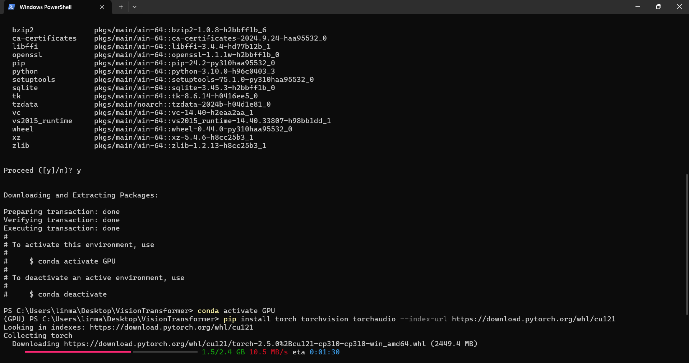</p>

> Windows 11
> - ```
>   pip install torch torchvision torchaudio --index-url https://download.pytorch.org/whl/cu121
>   ```
>
> Windows 10
> - ```
>   pip install torch torchvision torchaudio --index-url https://download.pytorch.org/whl/cu121
>   ```
> - ```
>   pip install pillow
>   ```
>
> macOS
> - ```
>   pip install torch torchvision torchaudio
>   ```
> - ```
>   pip install numpy
>   ```
> - ```
>   pip install pillow
>   ```
>
> Linux
> - ```
>   I don't know.
>   ```

# 4. 数据集预处理

在正式训练之前需要执行 Preprocessing.py 文件，对图片进行统计和处理。

```python
import os
from utils.tool import RandomSeed, Process

if __name__ == '__main__':
    os.system('')	# 使得终端 ASCII 颜色可以正常转义.
    print('\033[H\033[J', end = '')		# 清屏.
    RandomSeed(42)    # 播下随机种子, 使得每次执行程序结果相同.
    Process(
        dir = './datasets/Animals',  # 需要处理的图片集目录.
        ratio = [7, 2, 1], # 训练集、测试集、验证集比例, 不限格式.
        show = True,    # 展示预处理结果.
        resolution = True   # 统计图片平均分辨率.
    )
```

```
>>> python ./Preprocessing.py
```

<p style="text-align: center;">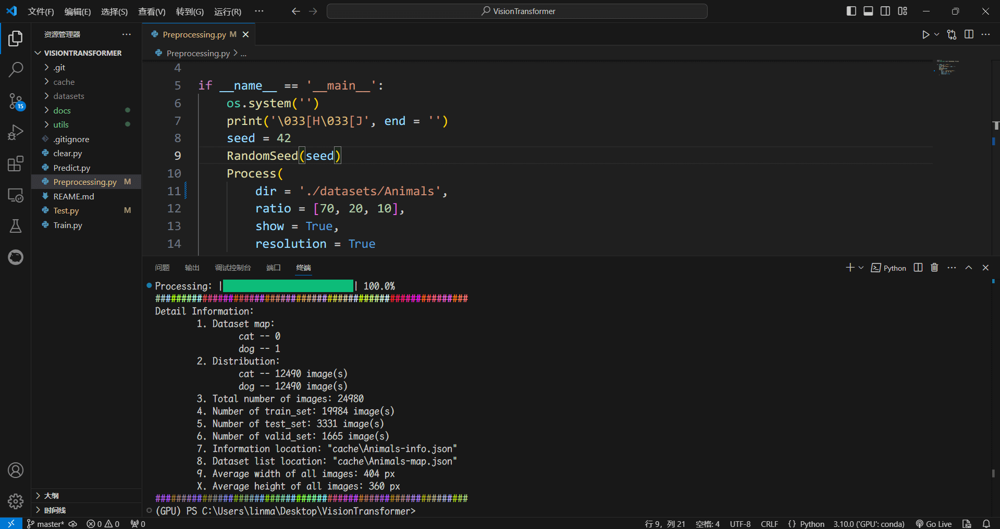</p>

# 5. 训练

`"./cache/log"` 文件夹的 Animals.pt 和 Fruits.pt 是我已经训练 200 轮后，得到了非常好的权重文件，你可以直接拿这两个权重文件进行测试、预测，跳过训练环节。毕竟，训练是很耗时间的。

如果你想重头开始进行水果、动物、血细胞图片集训练，或者对自己的数据集进行训练，你可以在 Preprocessing.py 完成后，执行 Train.py 文件。

```python
import torch
import platform
from utils.net import Transformer
from utils.interface import TrainActivate

if __name__ == '__main__':
    DATASET_NAME = 'Fruits' # 图片集的文件夹名称, 即训练的类型.
    device = torch.device(
        ('mps' if platform.system() == 'Darwin' else 'cuda')
        if torch.cuda.is_available() else 'cpu'
    )   # 程序计算使用的处理器.
    net = Transformer(info_path = f'./cache/{DATASET_NAME}-info.json').to(device)
    optimizer = torch.optim.Adam(params = net.parameters(), lr = 3e-5)
    parameters: dict = {
        'train_test_valid_set_map': f'./cache/{DATASET_NAME}-map.json',
        'epoch': 200,   # 迭代次数.
        'batch_size': 256,  # 处理器一次性计算的图片个数.
        'model': net,
        'device': device,
        'optimizer': optimizer,
        'scheduler': torch.optim.lr_scheduler.StepLR(
            optimizer = optimizer,
            step_size = 1,
            gamma = 0.7
        ),
        'criterion': torch.nn.CrossEntropyLoss()
    }
    TrainActivate(parameters)
```

```
>>> python ./Train.py
```


<p style="text-align: center;">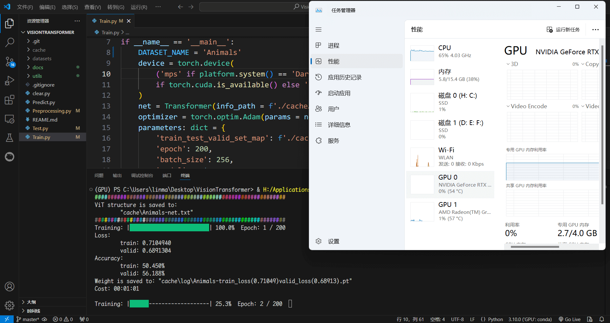</p>

<p style="text-align: center;">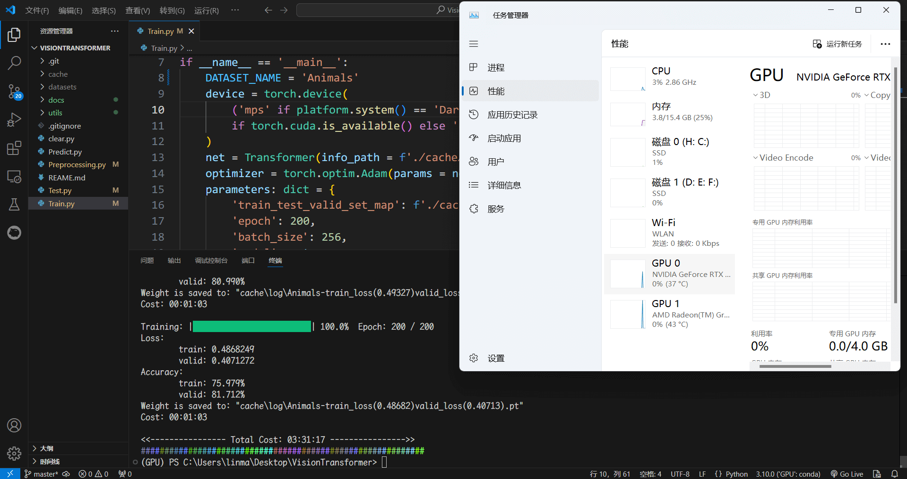</p>

<p style="text-align: center;">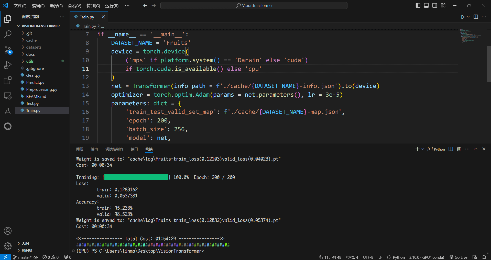</p>

上面这三张连续图片是我对 Animals 和 Fruits 两类图片集各训练 200 次的过程，其中 Animals 耗时 03:31:17 较长， Fruits 训练耗时 01:54:29 较短。

程序代码自动将训练结果全部保存在 `"./cache"` 目录下，其中子文件夹 `log` 是存放训练权重，你可以看到 `log` 里的动物和水果权重，这是我训练出的最优权重。

# 6. 测试

Illustrate.py 文件是用于绘制训练过程的插图，你可以根据它的结果找一个笼统的区间范围，再从区间内找一个最优的训练权重文件。当然，你可以直接使用 `"./cache/log"` 目录中我训练好的两个最优权重进行测试。

```
>>> python ./Illustrate.py
```

<div style="display: flex; justify-content: space-between;">
    <p style="text-align: center;">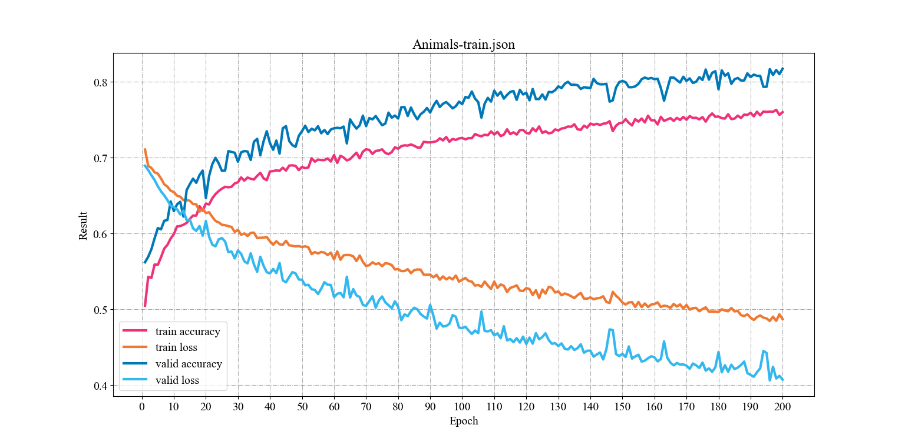</p>
    <p style="text-align: center;">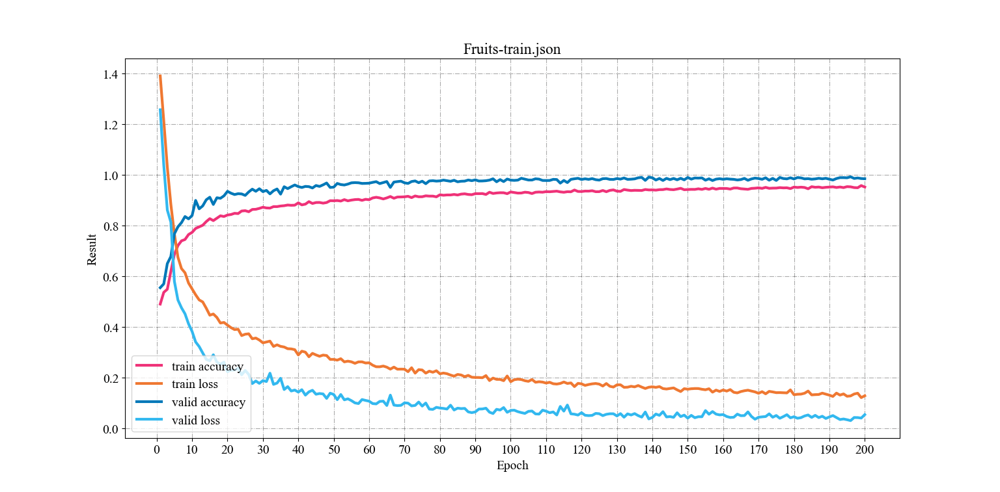</p>
</div>

```python
import torch
import platform
from utils.interface import TestActivate

if __name__ == '__main__':
    params = {
        'batch_size': 128,  # 处理器一次计算测试的图片个数.
        # 映射字典路径.
        'train_test_valid_set_map': './cache/Fruits-map.json',
        # 权重文件路径.
        'weight': './cache/log/Fruits-train_loss(0.12103)valid_loss(0.04023).pt',
        'device': torch.device(
            ('mps' if platform.system() == 'Darwin' else 'cuda')
            if torch.cuda.is_available() else 'cpu'
        )
    }
    TestActivate(params)
```

```
>>> python ./Test.py
```

最终测试结果会返回并保存一个正确率指数，水果测试集达到 98% 的正确率，相当高。

<p style="text-align: center;">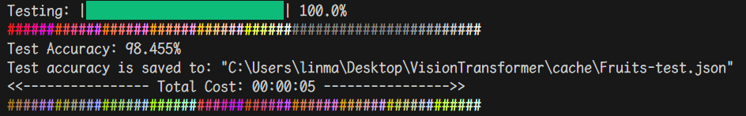</p>

# 7. 预测

水果 Fruits 测试集正确率高达 98%，因此表明训练的权重相当好，那么我们可将这个权重用于未知图片集的预测。

```python
import torch
import platform
from utils.interface import PredictActivate

if __name__ == '__main__':
    params = {
        'batch_size': 1536, # 处理器一次性预测计算的图片个数.
        # 数据集详情文件路径.
        'info_path': './cache/Fruits-info.json',
        # 待预测的图片集目录.
        'predict_images_dir': './datasets/Unknown-Fruits',
        # 使用训练好的权重文件路径.
        'weight': './cache/log/Fruits-train_loss(0.12103)valid_loss(0.04023).pt',
        'device': torch.device(
            ('mps' if platform.system() == 'Darwin' else 'cuda')
            if torch.cuda.is_available() else 'cpu'
        )
    }
    PredictActivate(params)
```

```
>>> python ./Predict.py
```

<p style="text-align: center;">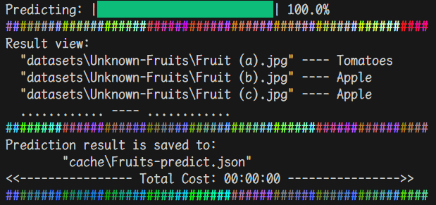</p>

<p style="text-align: center;">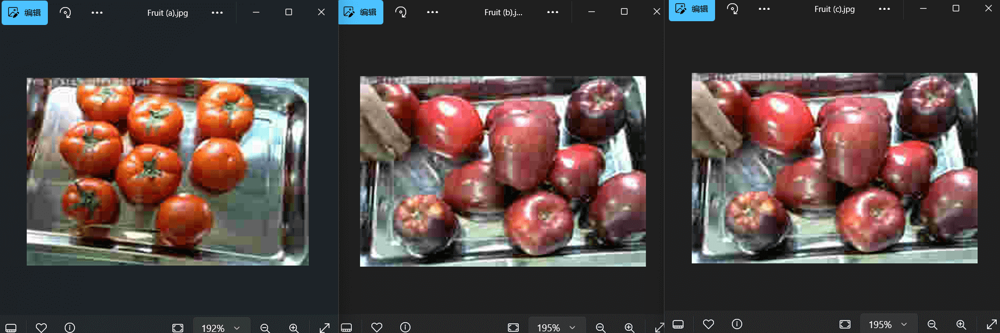</p>

<p style="text-align: center;"></p>

# 8. 开源同步

> GPLv3
>
> [https://orzzz.net](https://www.orzzz.net)
>
> [GitHub Repository](https://github.com/Illusionna/VisionTransformer)